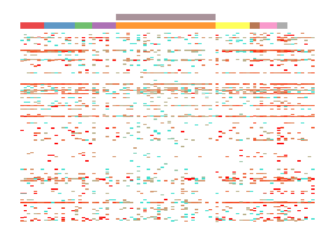
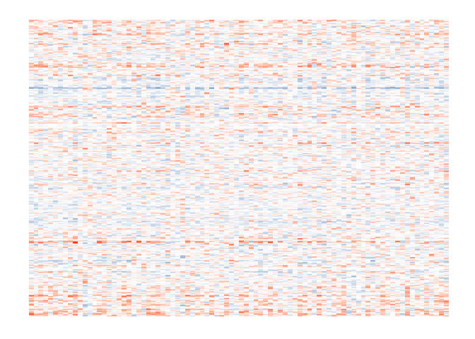
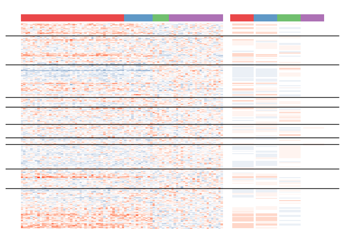

# Chloris
A Bayesian framework for analysing CNA intra-tumoral heterogeneity from scRNA data. 

The model specification is detailed in the following publication:  
[Qiao, P., Kwok, C. F., Qian, G., & McCarthy, D. J. (2023). Bayesian inference for copy number intra-tumoral heterogeneity from single-cell RNA-sequencing data. bioRxiv, 2023-10.](https://www.biorxiv.org/content/10.1101/2023.10.22.563455v1)

## Installation
```
require(devtools)
devtools::install_github('pqiao29/Chloris')
```

## Example

### Identifying clonal structure of Copy Number Alteration in Single-Cell RNA-Seq Expression Data

```
# Source helper functions for preprocessing the melanoma dataset
source(system.file("infercnv_utils.R", package = "Chloris"))
source(system.file("BAF_window.R", package = "Chloris"))

# Load libraries and datasets
library(Chloris)
library(SingleCellExperiment)

load(system.file("extdata", "M71_BAF.rda", package = "Chloris"), verbose = TRUE)
# Loading objects:
#   BAF

load(system.file("extdata", "M71_expr.rda", package = "Chloris"), verbose = TRUE)
# Loading objects:
#   sce
```

```
sce
## class: SingleCellExperiment 
## dim: 6624 86 
## metadata(0):
## assays(1): counts
## rownames(6624): ENSG00000223972 ENSG00000227232 ... ENSG00000125522
##   ENSG00000203880
## rowData names(2): gene_order gene_name
## colnames(86): Cy71-CD45-A03_S483 Cy71-CD45-A04_S484 ...
##   Cy71-CD45-H11_S575 Cy71-CD45-H12_S576
## colData names(0):
## reducedDimNames(0):
## mainExpName: NULL
## altExpNames(0):
```


#### Separate normal cells using BAF

The `Chloris` function can take one of the following input: 

- **BAF (A and D)**: $M\times N$ matrices representing counts of the alternative allele (A) and total allele (D) at $M$ heterozygous SNPs across $N$ cells.
- **RDR**: $M\times N$matrics of Relative Depth Ratio of $M$ genes in $N$ cells. 

- When A and D are provided and RDR = NULL, Chloris performs normal vs. tumor cell classification.
- When RDR is provided, Chloris clusters cells into sub-tumoral clones and infers their clonal copy-number profiles.
  If A and D are also provided, BAF information is integrated into the model. Otherwise, the clonal structure is inferred using RDR alone.


See `?Chloris` for the full list of options / arguments. 

```
## Window smooth BAF to obercome sparsity
BAF <- BAF_window(BAF$A, BAF$D, window_size = 20) 

## Run model
system.time({
    get_norm <- Chloris(A = BAF$A, D = BAF$D, S = 2, init = "random", break_idx = NULL,  
                        burnin_tol = 100, Gibbs_tol = 100, 
                        cluster_shrink_tol = 10, min_cluster_size = 2, verbose = FALSE)
})
```

```
##    user  system elapsed 
## 392.507   3.094 398.235
```


The output of the `Chloris` function is a list containing

- **cluster_est**:  A vector of cluster labels of each single cell
- **state_est**: A $k \times M$ matrix with clonal copy-number state labels, where $K$ is the inferred number of clones and $M$ is the number of genes. 
- **par_record**: An array containing parameters for each copy number state across all Gibbs iterations: $\mu$ and $\sigma$ for RDR and $\theta$ for BAF.


```
## Find normal clone
sce$is_normal_cell <- get_norm$cluster_est == which.min(apply(get_norm$state_est, 1, function(x) sum(x == 1)))
table(sce$is_normal_cell)
```

```
## FALSE  TRUE 
##    57    29
```

```
## Visualize result
plot_inout(BAF$A/BAF$D, "BAF", list(get_norm$cluster_est, sce$is_normal_cell))
```





#### Compute RDR

```
## Normalization
tmp_data <- counts(sce)
cs = colSums(tmp_data)
tmp_data <- sweep(tmp_data, STATS = cs, MARGIN = 2, FUN="/")  
normalize_factor = median(cs)  # normalize_factor
normalized <- tmp_data * normalize_factor

## Get RDR from gene expr
normalized <- log2(normalized + 1)
ref <- rowMeans(normalized[, sce$is_normal_cell])
RDR <- normalized - ref

## Window smoothing
RDR <- apply(RDR, 2, smooth_helper, window_length = 51)

## Recentering
col_median <- apply(RDR, 2, function(x) { median(x, na.rm=TRUE) } )
RDR <- t(apply(RDR, 1, "-", col_median))
assays(sce)$RDR <- RDR

## Visualise produced RDR
plot_inout(RDR)
```




#### Run full model

```
## Get index of the first gene in each chrmosome
chrs <- rowData(sce)$gene_order$chr
break_idx <- which(chrs[-1]  - chrs[-length(chrs)] > 0) + 1

## Run full model
system.time({
    res <- Chloris(assays(sce)$RDR, A = BAF$A, D = BAF$D, 
                   break_idx = break_idx, burnin_tol = 300, Gibbs_tol = 300,
                   cluster_shrink_tol = 10, min_cluster_size = 2, verbose = FALSE)
})
```

```
##     user   system  elapsed 
## 1188.759    6.154 1202.673
```

```
## Visualize result
plot_inout(assays(sce)$RDR, "RDR", list(res$cluster_est), CN_states = res$state_est, 
           break_idx = break_idx)
```

